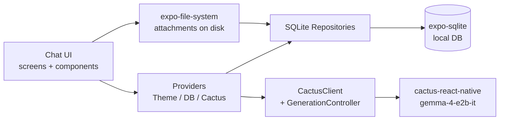

# Local ChatGPT-style mobile app

A private, offline-first chat app on Expo SDK 55 + `cactus-react-native`, model `google/gemma-4-E2B-it` (Cactus alias `gemma-4-e2b-it`).

## Architecture

Three layers, strictly separated:

- UI = `src/components/**` + `src/app/**` (Expo Router screens).
- DB = `src/db/**` (one `Database` singleton + per-table repositories).
- AI = `src/ai/**` (`CactusClient`, `PromptBuilder`, `GenerationController`, `AttachmentPipeline`, `RAG`).

## Key decisions

- **Cactus model**: Pin `model: 'gemma-4-e2b-it'`, `options: { quantization: 'int8', pro: false }`. Display name `google/gemma-4-E2B-it` is a constant in `theme/typography` / `constants`.
- **Cloud / telemetry disabled at every `complete()` call**: `telemetryEnabled: false`, `confidenceThreshold: 0` (so cloud handoff is never triggered; default 0.7 → set to 0). We also wrap `cactusClient.complete()` to always merge these defaults, so individual call sites can't accidentally re-enable them.
- **Storage**: `expo-sqlite` with `PRAGMA journal_mode=WAL`, `PRAGMA foreign_keys=ON`. Attachments stored under `${Paths.document}/attachments/<threadId>/<attachmentId>.<ext>`; SQLite stores only the path + metadata.
- **No new third-party libs**. We add: `cactus-react-native`, `react-native-nitro-modules`, `expo-sqlite`, `expo-file-system`, `expo-image-picker`, `expo-document-picker` (all Expo first-party, ship with the SDK). We delete the unused starter deps: `@react-navigation/bottom-tabs`, `@react-navigation/elements`, `expo-image`, `expo-glass-effect`, `expo-symbols`, `expo-web-browser`. `expo-router`, `react-native-safe-area-context`, `react-native-gesture-handler`, `react-native-reanimated`, `react-native-screens`, `expo-font`, `expo-splash-screen`, `expo-status-bar`, `expo-linking`, `expo-constants`, `expo-device`, `expo-system-ui`, `react-native-worklets` stay (already in template).
- **Native build**: `cactus-react-native` needs native code → app must be run via `expo prebuild` + EAS dev client (not Expo Go). README documents this.
- **Modalities**:
  - **Images**: passed to `complete({ messages: [{ images: [path] }] })` since `gemma-4-e2b-it` is multimodal.
  - **Audio**: stored locally; m4a/wav from the picker is not decoded to PCM in JS, so we surface "audio understanding is not enabled in this build" and persist the file. Documented as a known limitation.
  - **Video / PDF / documents**: stored locally with unsupported-message; PDF can be opted into RAG only by user pasting/typing extracted text into a thread (no parser bundled).
- **RAG**: backed by Cactus's `corpusDir` + `ragQuery` against a per-app text corpus directory at `${Paths.document}/rag-corpus`. We expose a "Save to memory" affordance on assistant/user text messages; the text becomes a `.txt` file in the corpus dir. Re-initialize the Cactus instance with `corpusDir` set when corpus is non-empty.

## Database schema and migrations

`src/db/migrations.ts` runs a versioned `migrations` table. v1 creates:

- `threads(id TEXT PK, title TEXT NOT NULL, created_at INTEGER, updated_at INTEGER, pinned INTEGER DEFAULT 0, archived INTEGER DEFAULT 0)`
- `messages(id PK, thread_id FK→threads ON DELETE CASCADE, role CHECK IN('system','user','assistant'), content TEXT DEFAULT '', status CHECK IN('pending','streaming','complete','failed','cancelled'), error TEXT, created_at, updated_at, parent_message_id, metadata_json)`
- `attachments(id PK, message_id FK→messages CASCADE, thread_id FK→threads CASCADE, kind CHECK IN('image','audio','video','pdf','document','other'), mime_type, filename, local_uri NOT NULL, size_bytes, extracted_text, processing_status DEFAULT 'stored', created_at, metadata_json)`
- `settings(key PK, value TEXT NOT NULL)`
- `model_state(model_id PK, display_name, local_alias, downloaded INTEGER DEFAULT 0, initialized INTEGER DEFAULT 0, download_progress REAL DEFAULT 0, local_path, updated_at)`
- Indexes: `idx_threads_updated_at`, `idx_threads_pinned_updated_at`, `idx_messages_thread_created`, `idx_attachments_message`, `idx_attachments_thread`.

## Generation flow

1. User taps send. Composer locks; `GenerationController.start({ threadId, userContent, attachments })`.
2. Insert user message (`status='complete'`) + assistant placeholder (`status='streaming'`) in a single transaction.
3. Load last N messages from SQLite via `messagesRepo.listForThread(threadId, { limit: settings.contextMessageLimit })`.
4. `PromptBuilder.build(history, attachments)` produces `CactusLMMessage[]`, prepending the required system prompt:
   > “You are a private local AI assistant running fully on this device. Be helpful, concise, and honest. If a file or modality is unsupported, say so clearly. Do not claim to have internet access. Do not claim to have uploaded or downloaded anything except the local model if asked.”
5. `cactusClient.complete({ messages, onToken })` streams; `onToken` calls a debounced (`~50ms`) buffer that updates React state and persists `content` via `messagesRepo.appendStreaming(messageId, chunk)`.
6. On finish: set assistant message `status='complete'`, bump `threads.updated_at`, and if it's the thread's first user message, generate a 4–8 word title via a second `complete()` call constrained to ~24 tokens; deterministic fallback uses first ~6 words on failure.
7. Cancel = `cactusClient.stop()` + mark assistant message `status='cancelled'`.
8. Retry/regenerate = delete assistant message + rerun from prior user message.
9. Edit user message = update content, delete all subsequent messages in that thread, regenerate.

## UI surface (Expo Router)

- `src/app/_layout.tsx` → `SafeAreaProvider` → `ThemeProvider` → `DatabaseProvider` → `CactusProvider` → `<Stack/>` with header hidden.
- `src/app/index.tsx` → redirects to `/chat` (or last opened thread).
- `src/app/chat/index.tsx` → empty-state new chat screen.
- `src/app/chat/[threadId].tsx` → chat screen.
- `src/app/settings.tsx` → settings.
- `src/app/model.tsx` → model download/init screen, shown automatically by `CactusProvider` when not downloaded.

Custom in-project drawer (`components/chat/ThreadDrawer.tsx`) using `Animated` + a backdrop `Pressable`; no `@react-navigation/drawer` dependency.

Custom icons: lucide icons, if not available, make customs

## Files to create / modify / delete

**Delete (template):** `src/app/explore.tsx`, `src/app/index.tsx` (replace), `src/components/animated-icon*.{tsx,web.tsx,module.css}`, `src/components/app-tabs.{tsx,web.tsx}`, `src/components/themed-{text,view}.tsx`, `src/components/hint-row.tsx`, `src/components/web-badge.tsx`, `src/components/external-link.tsx`, `src/components/ui/collapsible.tsx`, `src/hooks/use-color-scheme.{ts,web.ts}`, `src/hooks/use-theme.ts`, `src/global.css`, `src/constants/theme.ts`.

**Create — providers & layout:**

- `src/app/_layout.tsx`, `src/app/index.tsx`, `src/app/chat/_layout.tsx`, `src/app/chat/index.tsx`, `src/app/chat/[threadId].tsx`, `src/app/settings.tsx`, `src/app/model.tsx`
- `src/providers/ThemeProvider.tsx`, `src/providers/DatabaseProvider.tsx`, `src/providers/CactusProvider.tsx`

**Create — UI:**

- `src/components/chat/{ChatScreen,ChatHeader,ThreadDrawer,ThreadListItem,MessageList,MessageBubble,Composer,AttachmentPreview,StreamingCursor,ModelGate}.tsx`
- `src/components/common/{Button,IconButton,Modal,TextInput,Surface,EmptyState,LoadingState,ErrorBoundary,Icons,Divider,ProgressBar}.tsx`

**Create — DB:**

- `src/db/sqlite.ts` (singleton, opens DB, runs migrations, exports `db`)
- `src/db/migrations.ts` (versioned migration runner)
- `src/db/repositories/{threadsRepo,messagesRepo,attachmentsRepo,settingsRepo,modelStateRepo}.ts`

**Create — AI:**

- `src/ai/cactusClient.ts` (wraps `CactusLM`, forces `telemetryEnabled: false`, `confidenceThreshold: 0`)
- `src/ai/promptBuilder.ts`
- `src/ai/generationController.ts`
- `src/ai/attachmentPipeline.ts` (validates kind, copies into app docs dir, returns metadata)
- `src/ai/rag.ts` (corpus dir helper + `ragQuery` passthrough)

**Create — hooks & utils:**

- `src/hooks/{useThreads,useMessages,useChatGeneration,useModelState,useTheme,useSettings}.ts`
- `src/native/fileStore.ts`, `src/native/sqlite.ts`
- `src/theme/{colors,spacing,typography,index}.ts`
- `src/utils/{ids,time,errors,json}.ts`

**Modify:**

- `package.json` — add Cactus + Expo SQLite/file-system/pickers, remove unused starter deps.
- `app.json` — add plugins `expo-sqlite`, `expo-file-system`, `expo-image-picker`, `expo-document-picker`, ensure `userInterfaceStyle: automatic`, `newArchEnabled: true`.
- `tsconfig.json` — already has `@/` path alias; verify and leave.
- `README.md` — rewritten: setup (`npm install`, `npx expo prebuild`, EAS dev client), model download flow, offline guarantee, supported modalities, limitations.

## Implementation order (todos)

Each step is one logical commit; UI todos come last so the data and AI plumbing is verified first.
