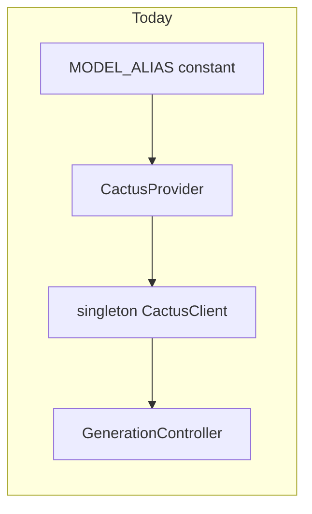
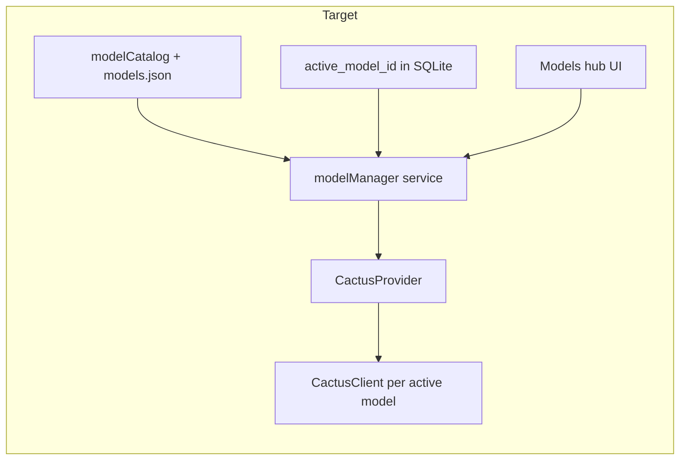

# Multi-model management plan

## Current state (single-model)

The app is built around one constant in `[src/theme/typography.ts](src/theme/typography.ts)`:

```ts
export const MODEL_ALIAS = "gemma-4-e2b-it";
```

`[CactusProvider](src/providers/CactusProvider.tsx)` creates a **singleton** `[CactusClient](src/ai/cactusClient.ts)` for that alias only. `[model_state](src/db/migrations.ts)` can store multiple rows, but only `MODEL_ID` is ever read/written. The `[/model](src/app/model.tsx)` screen is a single download/init flow, not a catalog.



## Target state (multi-model)



---

## Cactus research: registry, providers, compatibility

### Sources (merge at runtime)

| Source                                                                                 | Role                                                                                                                        |
| -------------------------------------------------------------------------------------- | --------------------------------------------------------------------------------------------------------------------------- |
| `getRegistry()` from `cactus-react-native`                                             | **Authoritative** for download URLs, quant weights (`int4`/`int8`), registry keys (lowercase aliases e.g. `gemma-4-e2b-it`) |
| [cactus `models.json](https://github.com/cactus-compute/cactus/blob/main/models.json)` | **Rich metadata**: `tags`, `description`, `pipeline_tag`, `int4`/`int8`/`fp16`/`apple` flags                                |
| [Cactus README](https://github.com/cactus-compute/cactus)                              | Benchmarks (RAM, tok/s), feature matrix, gated-model note                                                                   |

Bundle a trimmed copy as `[src/ai/data/cactus-models.json](src/ai/data/cactus-models.json)` (synced from upstream; chat-relevant entries + optional STT/embed for “All” tab). At startup, **join** registry keys with JSON rows by normalizing IDs (`google/gemma-4-E2B-it` → `gemma-4-e2b-it`).

### Provider aggregation (chat catalog)

Group by HuggingFace org prefix:

| Provider                     | Example models                                                           | Chat-relevant                          |
| ---------------------------- | ------------------------------------------------------------------------ | -------------------------------------- |
| **Google / Gemma**           | `gemma-3-270m-it`, `gemma-4-e2b-it`, `gemma-4-e4b-it`, `gemma-3n-e2b-it` | Text + multimodal (E2B/E4B)            |
| **Qwen**                     | `Qwen3-0.6B`, `Qwen3.5-0.8B`, `Qwen3.5-2B`, `Qwen3-1.7B`                 | Text + vision (3.5 VL)                 |
| **Liquid AI**                | `LFM2.5-350M` … `LFM2-8B-A1B`, `LFM2.5-VL-`                              | Text + vision VL line                  |
| **Tencent**                  | `Youtu-LLM-2B`                                                           | Text / tools / embed                   |
| **OpenAI / NVIDIA / others** | Whisper, Parakeet, embed-only                                            | **Secondary tab** (not chat LLM today) |

Default **Chat models** filter: `pipeline_tag` is `text-generation` or `image-text-to-text`, and `tags` includes `completion`. Secondary **All models** tab shows STT (`automatic-speech-recognition`), embed (`feature-extraction`), VAD, etc., marked “Not used in chat yet.”

### Compatibility fields to show on every model card

Derived from `models.json` + registry + `Platform.OS`:

- **Capabilities (chips)**: `completion`, `tools`, `vision`, `audio`, `embed`, `transcription`, etc.
- **Quantization**: INT4 / INT8 / FP16 (only show options where flag is `true` in JSON **and** registry has that quant)
- **Apple NPU**: show on iOS when `apple: true` or tag `apple-npu` (aligns with README “5–11x faster iOS/Mac”)
- **Size tier**: Small (<1B), Medium (1–3B), Large (>3B) from name/heuristic
- **Gated**: badge for Gemma 1B+ (README: HF token required) — link to settings placeholder for HF token (phase 2)
- **Recommended for this device**: optional heuristic (e.g. prefer <2B on low-RAM; prefer `apple-npu` models on iOS)
- **Download state**: not downloaded / downloading % / downloaded / active
- **Privacy**: “Runs on-device · no cloud handoff” (existing `telemetryEnabled: false` policy unchanged)

### Registry ↔ display ID mapping

- **Registry key** (SDK): `gemma-4-e2b-it`
- **Display ID** (UI/DB): `google/gemma-4-E2B-it`
- Store **both** in `model_state`: `model_id` = display ID, `local_alias` = registry key (already exists)

Reuse existing download fix in `[src/ai/modelDownload.ts](src/ai/modelDownload.ts)` (`main` revision fallback) for every model.

---

## UI requirements (user-facing)

### 1. Models hub — replace `[src/app/model.tsx](src/app/model.tsx)`

- **Header**: “Models” + search
- **Segmented control**: `Chat` | `All` | `Downloaded`
- **Provider sections** (collapsible): Gemma, Qwen, Liquid AI, Tencent, …
- **Model row/card** per model:
  - Display name, short description
  - Capability chips + quant badges + Apple NPU (iOS)
  - Status: Active · Downloaded · Not downloaded
  - Primary action: Download / Use / Delete (contextual)
- **Tap row** → **Model detail sheet**:
  - Full description, all compatibility rows
  - Quant picker (INT4 default, INT8 if available)
  - Download progress bar
  - Buttons: **Set active**, **Download**, **Delete from device**, **Cancel download**
- **Empty states**: no downloads yet; registry fetch failed (retry)

### 2. Active model affordances

- **Chat header** (`[ChatHeader.tsx](src/components/chat/ChatHeader.tsx)`): subtitle shows **active model display name** (not hardcoded `MODEL_DISPLAY_NAME`); tap opens Models hub
- **Model gate** (`[ModelGate.tsx](src/components/chat/ModelGate.tsx)`): references active model; CTA → Models hub
- **Settings** (`[settings.tsx](src/app/settings.tsx)`):
  - “Active model” row → Models hub
  - “Manage downloads” section
  - Replace single “Delete local model” with per-model delete (or link to hub)
  - Keep global “Delete all data” (does not remove weight files unless user chooses)

### 3. Switching & safety

- **Set active**: if model not downloaded → prompt download first
- If generation in progress → block switch with alert
- Switching model: `destroy()` old client → new `CactusClient` → optional auto-init if already downloaded
- **Composer**: disable send when active model not downloaded/initialized; vision attachments only if active model has `vision` tag

### 4. Optional polish (same milestone if low cost)

- Filter chips: Vision only, Tools, Small models, Apple NPU
- Sort: Recommended, Name, Size
- “Storage used” footer (sum of downloaded models via `CactusFileSystem.getModelPath` + file size)

# User Response:

Seems good. but make sure to give tags like how much size that model is, what's it's parameters and everything. user should get a clear understanding of what he is downloading.

---

## Data layer changes

### Migration v2 (`[src/db/migrations.ts](src/db/migrations.ts)`)

- `settings`: ensure key `inference.activeModelId` (default `google/gemma-4-E2B-it`)
- `model_state` add columns: `quantization TEXT`, `features_json TEXT`, `provider TEXT`, `size_tier TEXT`
- `modelStateRepo`: add `list()`, `listDownloaded()`, `remove(modelId)` (delete row + clear flags)
- Migrate existing installs: seed active model + preserve current `gemma-4-e2b-it` download state

### Thread ↔ model (recommended v2.1)

- Add optional `threads.model_id` so old chats show which model created them; new chats copy `activeModelId` at creation
- Chat header subtitle: “Gemma 4 E2B · Local · Ready”

---

## New modules / refactors

| Module                                                                          | Responsibility                                                                                               |
| ------------------------------------------------------------------------------- | ------------------------------------------------------------------------------------------------------------ |
| `[src/ai/data/cactus-models.json](src/ai/data/cactus-models.json)`              | Bundled metadata from upstream `models.json`                                                                 |
| `[src/ai/modelCatalog.ts](src/ai/modelCatalog.ts)`                              | `fetchCatalog()`, `groupByProvider()`, filters, ID normalization                                             |
| `[src/ai/modelCapabilities.ts](src/ai/modelCapabilities.ts)`                    | Parse tags → `supportsVision`, `supportsTools`, chip labels                                                  |
| `[src/ai/modelManager.ts](src/ai/modelManager.ts)`                              | download / delete / switchActive / checkDisk; orchestrates `CactusFileSystem`                                |
| Refactor `[src/ai/cactusClient.ts](src/ai/cactusClient.ts)`                     | Remove hard dependency on `MODEL_ALIAS`; factory `createCactusClient(config)`                                |
| Refactor `[src/providers/CactusProvider.tsx](src/providers/CactusProvider.tsx)` | `activeModel`, `installedModels`, `setActiveModel`, `downloadModel(id)`, `deleteModel(id)`, `refreshCatalog` |
| `[src/hooks/useModelCatalog.ts](src/hooks/useModelCatalog.ts)`                  | Catalog + search + filters                                                                                   |
| `[src/hooks/useActiveModel.ts](src/hooks/useActiveModel.ts)`                    | Thin wrapper over provider                                                                                   |
| UI: `[src/components/models/](src/components/models/)`                          | `ModelCatalogScreen`, `ProviderSection`, `ModelCard`, `ModelDetailSheet`, `CapabilityChips`, `QuantSelector` |
| Routes: `[src/app/models/](src/app/models/)`                                    | `index.tsx` (hub), `_layout.tsx`; redirect `/model` → `/models`                                              |

**No new npm packages required** for v1 (registry + bundled JSON). Optional later: none unless we add HF token secure storage (`expo-secure-store`).

---

## Engine behavior (must not regress)

- Keep privacy defaults in `[cactusClient.ts](src/ai/cactusClient.ts)`: `telemetryEnabled: false`, `confidenceThreshold: 0`
- `[generationController.ts](src/ai/generationController.ts)`: unchanged contract; reads active client from provider
- **Quantization**: persist per-model in `model_state`; pass to `CactusLM` options
- **Vision path**: `[promptBuilder.ts](src/ai/promptBuilder.ts)` only attach images if `catalog.supportsVision(activeModel)`
- **Singleton removal**: `getCactusClient()` becomes `getActiveCactusClient()` tied to provider state

---

## Implementation phases

### Phase 1 — Catalog & data (foundation)

- Add bundled `cactus-models.json` + `modelCatalog.ts` with provider grouping
- Migration v2 + settings `activeModelId` + extend `modelStateRepo`
- Unit-test ID normalization and filter logic (pure functions)

### Phase 2 — Model manager & provider

- `modelManager.ts` + refactor `CactusClient` factory
- Rewrite `CactusProvider` for multi-model + `setActiveModel` / download / delete
- Wire `ChatHeader`, `ModelGate`, `useChatGeneration` to active model

### Phase 3 — Models hub UI

- Build components under `src/components/models/`
- Replace `/model` with `/models` hub (search, tabs, provider sections, detail sheet)
- Update settings links

### Phase 4 — Polish & docs

- Vision/tools gating in composer
- Storage footer, filters
- README section: choosing models, storage, switching, gated models

---

## Execution prompt (run after plan approval)

Use this verbatim in Agent mode to implement:

> **Task: Multi-model management for local-llm**
>
> 1. Add `src/ai/data/cactus-models.json` from [https://github.com/cactus-compute/cactus/blob/main/models.json](https://github.com/cactus-compute/cactus/blob/main/models.json) (chat entries at minimum).
> 2. Implement `modelCatalog.ts` (merge `getRegistry()` + bundled JSON, group by provider: Gemma/Qwen/LiquidAI/Tencent/Other, normalize registry aliases).
> 3. DB migration v2: `activeModelId` setting, extend `model_state`, `modelStateRepo.list/remove`.
> 4. Refactor `cactusClient` to accept `modelAlias` + `quantization`; remove hardcoded `MODEL_ALIAS` from runtime path.
> 5. Implement `modelManager.ts` (download via `resolveModelDownloadUrl`, delete via `CactusFileSystem`, switch active with destroy/recreate).
> 6. Rewrite `CactusProvider` to track multiple models, expose `activeModel`, `downloadModel`, `deleteModel`, `setActiveModel`.
> 7. Build Models hub UI at `src/app/models/index.tsx` with Chat/All/Downloaded tabs, provider sections, model cards showing capability chips + INT4/INT8 + Apple NPU + download/delete/use actions.
> 8. Update `ChatHeader`, `ModelGate`, `settings.tsx`, redirect `/model` → `/models`.
> 9. Gate vision attachments and composer on active model capabilities.
> 10. Default active model: `google/gemma-4-E2B-it` / alias `gemma-4-e2b-it`; migrate existing download state.
> 11. Run `npx tsc --noEmit` and fix lints.
>
> **Constraints:** Expo SDK 55, keep privacy defaults, no cloud handoff, match existing theme/components, minimal scope (no HF token UI unless trivial).

---

## Risks & mitigations

| Risk                             | Mitigation                                                            |
| -------------------------------- | --------------------------------------------------------------------- |
| Registry fetch offline           | Bundled JSON still lists models; download disabled with clear message |
| Large models OOM                 | Size tier + “Large” warning; default filter to <3B                    |
| Switch mid-chat confuses context | Show active model in header; optional `threads.model_id` later        |
| HF gated Gemma fails download    | Gated badge + README note; phase 2 HF token in settings               |
| Registry key ≠ display ID        | Central `normalizeModelId()` used everywhere                          |
