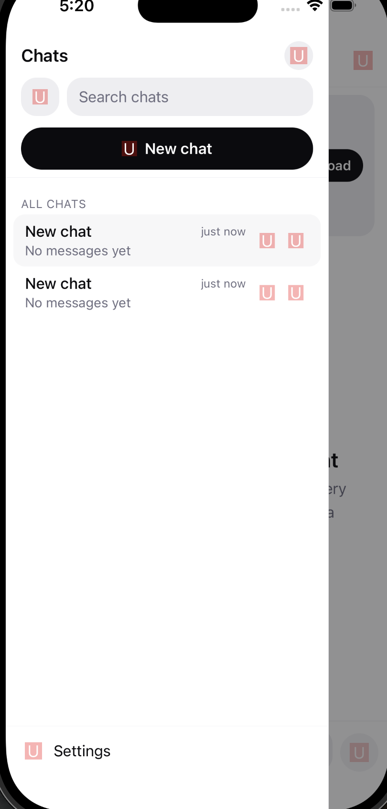

what are all those un, uni words? they should be icons. also, i need you to verify the the download of model. read https://github.com/cactus-compute/cactus-react-native again if necessary, but fix the download not found 404 error. fix icons, and fix download issue.
