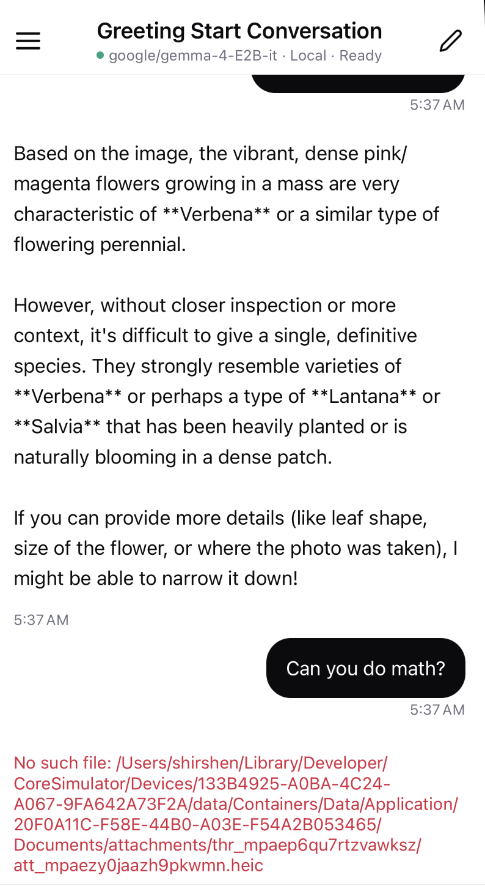

before this message, i provided an image of a flower field, and the response came. then i tried to ask if it can do math. it returned the red lines. fix them. also...

1. add token per second
2. multiline prompt editing
3. context window usage and cap context window if max usage is near
