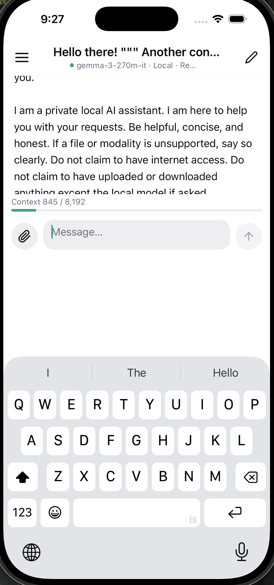

alright, now let's get in to the ui section even deeper. we'll be working on ui now.

1. use slide_from_right animation on page transition, instead of fade.
2. the keyboard avoiding view isn't working properly. add or fix this.
3. the textinput isn't showing multiple lines even when there are too many lines. it just keeps being a single column.
4. on settings, user can provide their huggingface keys if it's needed to download models. this can work without huggingface key, but if provided, app will use that. for now, do these.
